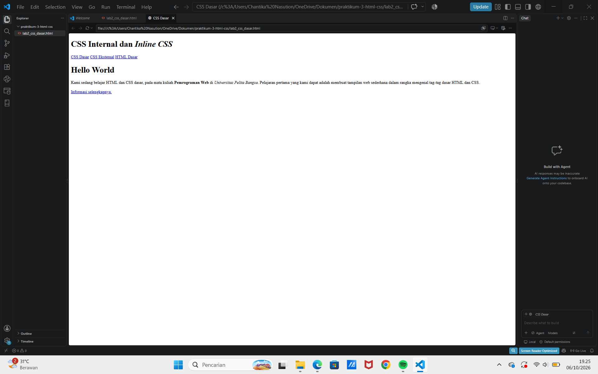
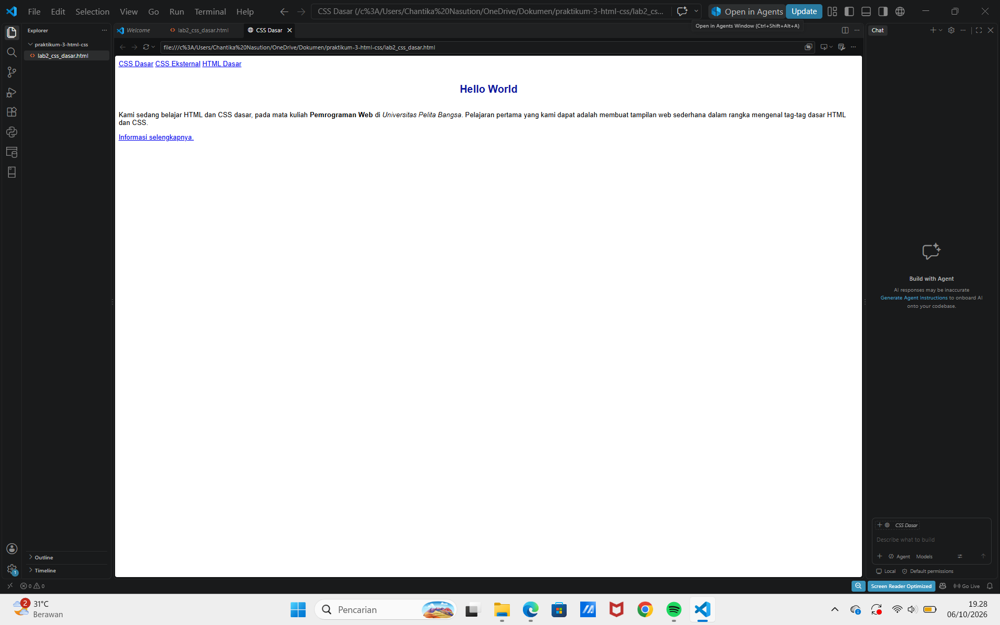
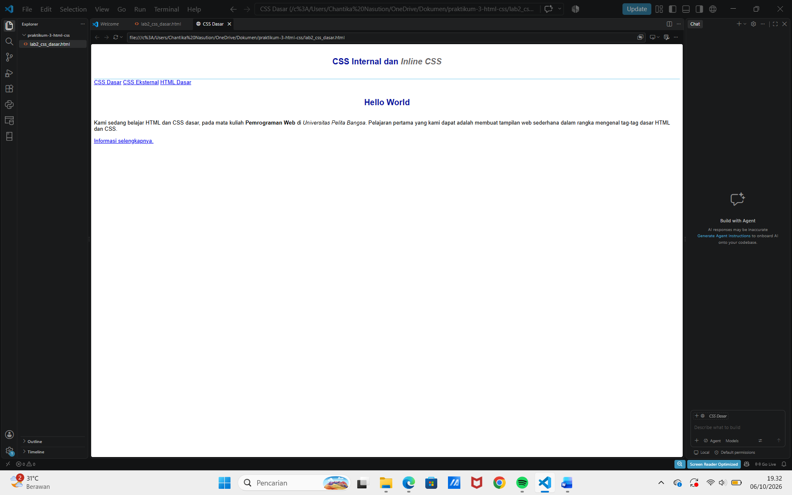
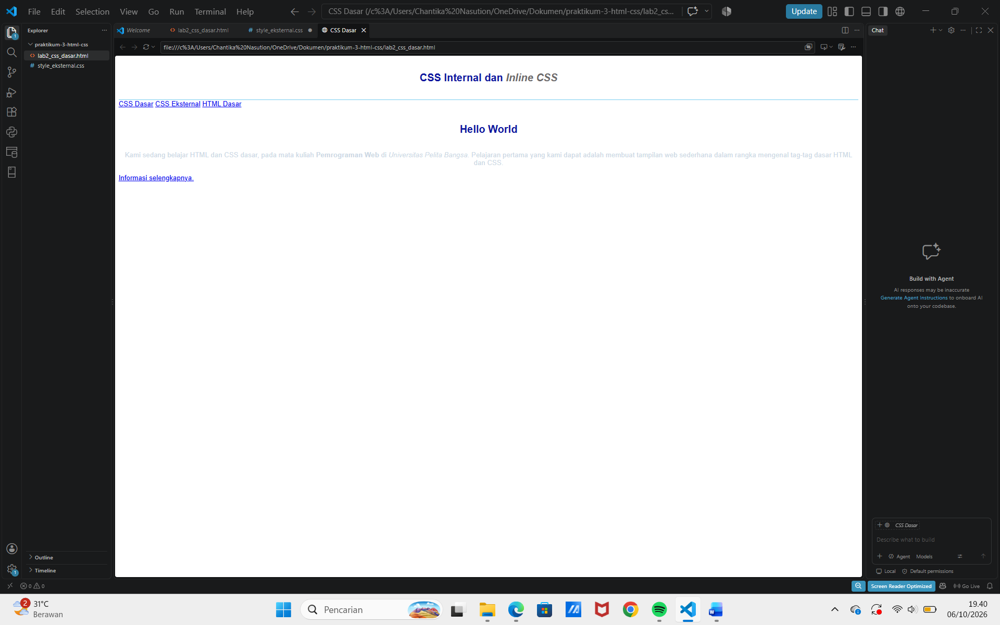
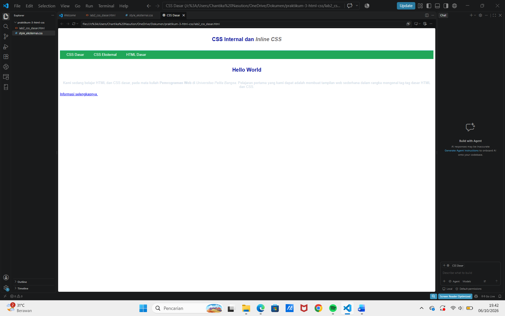
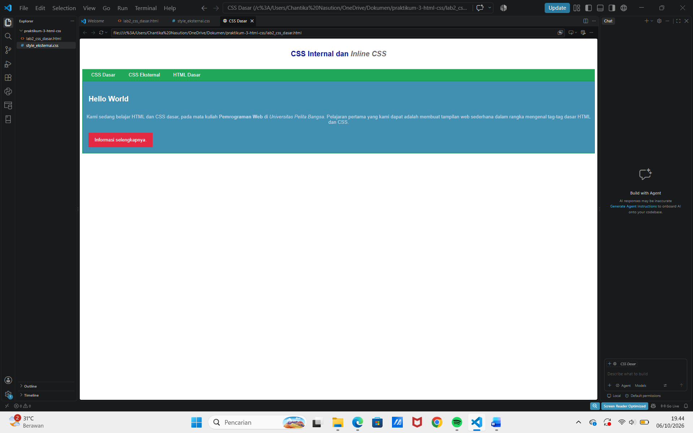

# Praktikum 3 - CSS Dasar

**Nama:** Cantika Fitri Hania Nasution
**NIM:** 312510093
**Kelas:** I252A

## Deskripsi

Praktikum 3 membahas dasar-dasar CSS (*Cascading Style Sheet*) untuk mengatur tampilan halaman web. Pada praktikum ini dilakukan penerapan CSS Internal, Inline, dan External, serta penggunaan CSS Selector berupa ID dan Class.

## Langkah-Langkah Praktikum

### 1. Membuat Dokumen HTML

Membuat file `lab2_css_dasar.html` yang berisi struktur dasar HTML, seperti header, navigasi, heading, paragraf, dan link.

### 2. Mendeklarasikan CSS Internal

Menambahkan CSS Internal menggunakan tag `<style>` pada bagian `<head>`. CSS digunakan untuk mengatur jenis font, ukuran teks, warna heading, posisi teks, dan tampilan header.

### 3. Menambahkan Inline CSS

Menambahkan Inline CSS secara langsung pada elemen paragraf menggunakan atribut `style`. Pengaturan ini digunakan untuk mengubah posisi dan warna teks.

### 4. Membuat CSS Eksternal

Membuat file `style_eksternal.css` untuk menyimpan aturan CSS secara terpisah dari dokumen HTML. File CSS kemudian dihubungkan ke HTML menggunakan tag `<link>`.

### 5. Menambahkan CSS Selector

Menambahkan ID Selector dan Class Selector pada file CSS eksternal. ID Selector digunakan untuk mengatur bagian `intro`, sedangkan Class Selector digunakan untuk mengatur tampilan tombol.

### 6. Eksperimen CSS

Melakukan eksperimen dengan mengubah dan menambahkan beberapa properti CSS, seperti `border`, `padding`, dan `border-radius`, untuk melihat pengaruhnya terhadap tampilan halaman web.

## Kesimpulan

Melalui praktikum ini, saya mempelajari cara menggunakan CSS untuk mengatur tampilan halaman HTML. Praktikum mencakup penerapan CSS Internal, Inline, dan External, serta penggunaan ID Selector dan Class Selector. Dengan CSS, tampilan halaman web dapat diatur agar lebih menarik dan terstruktur.
